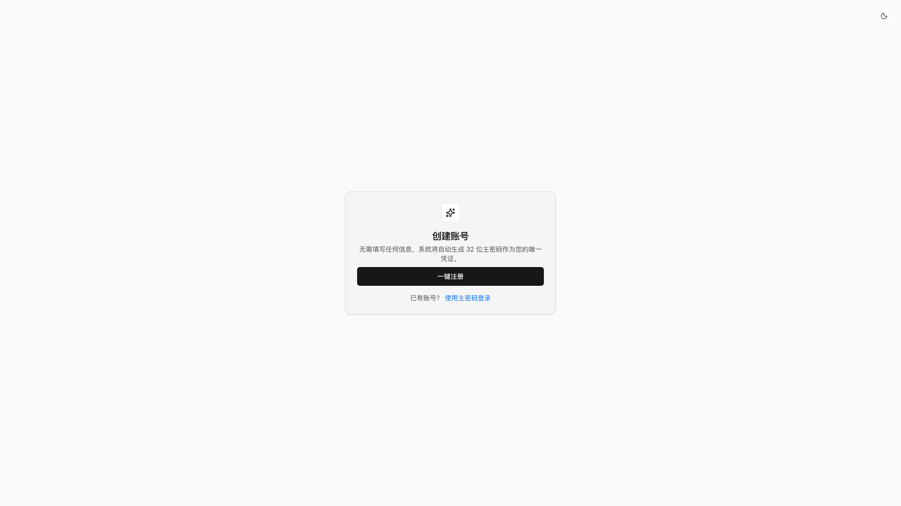
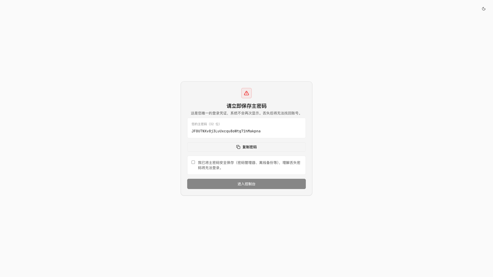
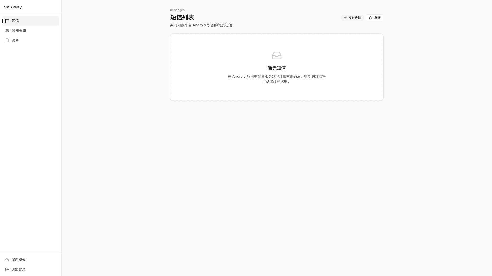
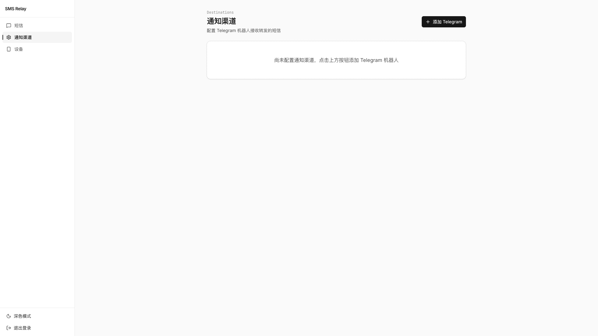
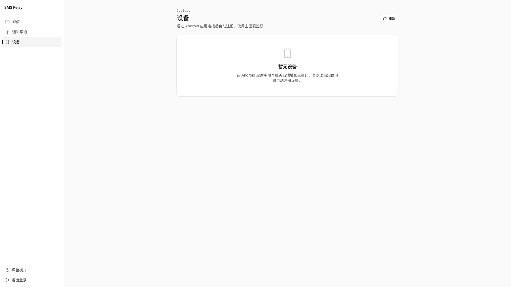
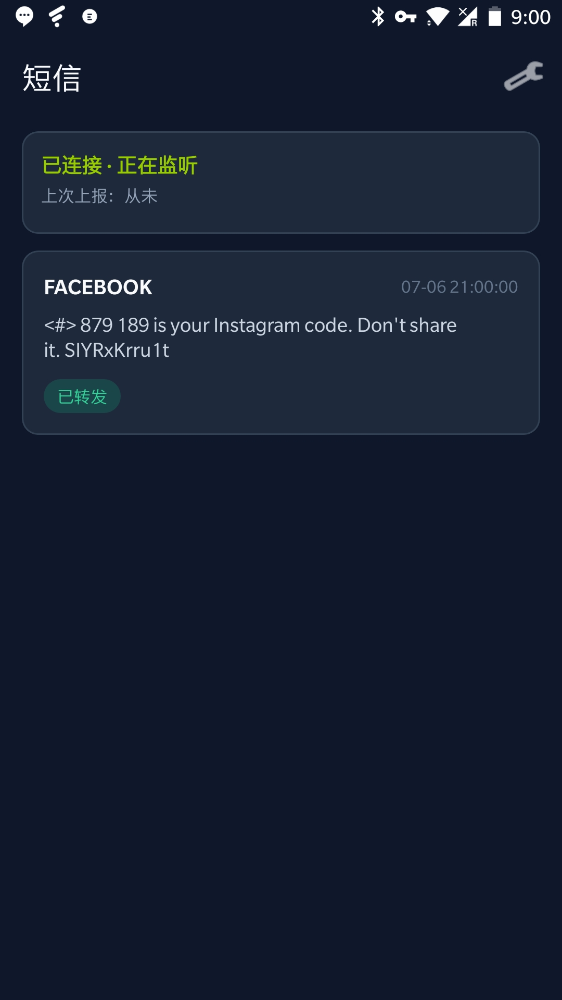
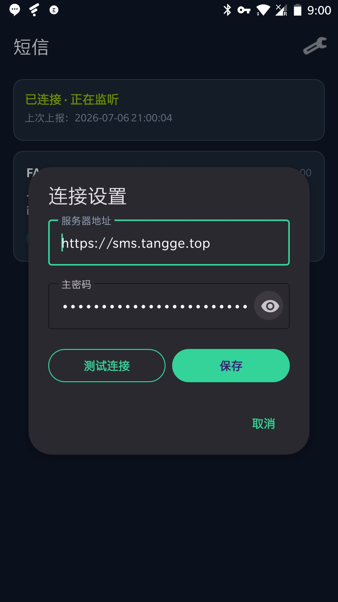

# SMS Relay

Android 短信采集 + Go 服务端加密存储 + Telegram 转发 + Web 管理控制台。

将 Android 手机收到的短信实时转发到 Telegram，并通过 Web 控制台统一管理设备、查看历史、配置通知渠道。

## 界面预览

### Web 控制台

| 注册账号 | 保存主密码 |
|:---:|:---:|
|  |  |

| 短信列表 | 通知渠道 | 设备管理 |
|:---:|:---:|:---:|
|  |  |  |

### Android 客户端

| 短信列表 | 服务器设置 |
|:---:|:---:|
|  |  |

## 功能概览

- **零注册表单**：Web 一键生成 32 位主密码，作为唯一登录凭证
- **短信加密存储**：服务端 AES-256-GCM 加密，SQLite 持久化
- **Telegram 转发**：支持 Bot Token 一键绑定或手动填写 Chat ID
- **实时同步**：Web 控制台 SSE 推送，Android 离线队列自动重传
- **设备自注册**：Android 填写主密码后首次上报即自动注册设备

## 架构

```
                    ┌──────────────── 生产：宿主机 Nginx（TLS、IP 限速） ────────────────┐
                    │  X-Forwarded-For = $remote_addr（覆盖伪造）                      │
                    └────────────────────────────┬────────────────────────────────────┘
                                                 ▼
Android App ──HTTPS──► web 容器 nginx ──► Go/Fiber Server ──► Telegram Bot
                              │                    │
                         React 静态页           SQLite（密文）
                              │                    │
Web 浏览器 ◄── JWT + SSE ─────┘                    └── SSE 推送
```

- **本地 Docker**：web `:5173` + server `:8080` 双端口；web 内 nginx 反代 `/api/`
- **生产**：单域名，仅暴露 web 端口；server 仅在 Docker 内网可达

详细设计见 [docs/architecture.md](docs/architecture.md) · 安全见 [docs/security.md](docs/security.md)

## 使用指南

完整流程：**部署服务 → Web 注册 → 配置 Telegram → Android 连接 → 收短信**

### 第一步：部署服务端

选择下方 [部署方式](#部署方式) 之一，确保 Web 控制台和 API 可访问。

部署完成后记下：
- **Web 地址**：如 `http://localhost:5173`（本地）或 `https://sms.example.com`（生产）
- **API 地址**：如 `http://localhost:8080/api/v1`（本地）或 `https://sms.example.com/api/v1`（生产）

> **备份 `.env`**：其中的 `DATABASE_ENCRYPTION_KEY` 用于解密数据库，`PASSWORD_PEPPER` 用于密码指纹查找，丢失后无法恢复已有数据。

### 第二步：Web 注册并保存主密码

1. 打开 Web 控制台，点击 **「一键注册」**
2. 系统生成 32 位主密码，**仅显示一次**
3. 复制并保存到密码管理器或离线备份
4. 勾选确认后进入控制台

### 第三步：配置 Telegram 通知渠道

1. 进入 **通知渠道** 页面，点击 **「添加 Telegram」**
2. 在 [@BotFather](https://t.me/BotFather) 创建 Bot，复制 Bot Token
3. 填写 Token 后点击 **「连接 Telegram」**，在 Telegram 中点击 Start 完成绑定
4. 也可选择 **「手动填写 Chat ID」** 直接保存

配置完成后，所有上报的短信将自动转发到绑定的 Telegram 对话。

### 第四步：安装并配置 Android App

> 短信权限需要**真机**，且 Google Play 不允许普通应用使用 SMS 权限，需**侧载 APK**。

**构建 APK：**

```bash
cd android
./gradlew assembleRelease
# 输出：android/app/build/outputs/apk/release/app-release.apk
```

或使用 Android Studio 打开 `android/` 目录，同步 Gradle 后运行到真机。

**App 内配置：**

| 设置项 | 填写内容 |
|--------|----------|
| 服务器地址 | 部署地址，如 `http://192.168.1.100:8080` 或 `https://sms.example.com`（**不要**加 `/api/v1`） |
| 主密码 | Web 注册时保存的 32 位密码 |

点击 **「保存并开始监听」**，授予短信权限后即可工作。

**Android 15+ 侧载提示：** 若权限无法授予，请到 应用信息 → ⋮ → **允许受限设置**，再手动开启短信权限。

**厂商后台保活（建议）：** 在 App 内点击「关闭电池优化」，并在系统设置中允许自启动、锁定后台（小米/华为/OPPO 等），否则后台可能被杀死。

### 第五步：验证

1. 向该 Android 手机发送一条测试短信
2. Android App 显示短信及 **「已转发」** 状态
3. Telegram 收到转发消息
4. Web **短信列表** 实时出现该条记录

App 内可点击 **「测试连接」** 发送测试消息到 Telegram，无需等待真实短信。

## 部署方式

### 方式一：Docker 本地部署（推荐）

适合在局域网或本机快速体验，Web 和 API 分别暴露端口。

```bash
chmod +x scripts/deploy.sh
./scripts/deploy.sh
```

脚本会自动：
- 生成 `.env` 及加密密钥（首次运行）
- 构建并启动 server + web 容器
- 等待健康检查通过后输出访问地址

| 服务 | 默认地址 |
|------|----------|
| Web 控制台 | http://localhost:5173 |
| API | http://localhost:8080/api/v1 |
| Android 填写 | `http://<本机局域网 IP>:8080` |

常用命令：

```bash
./scripts/deploy.sh          # 部署（默认）
./scripts/deploy.sh stop       # 停止
./scripts/deploy.sh restart    # 重启
./scripts/deploy.sh logs       # 查看日志
./scripts/deploy.sh status     # 容器状态
```

### 方式二：生产服务器部署

适合公网 VPS，从 Docker Hub 拉取镜像，**单域名** 同时提供 Web 和 API（web 容器内 nginx 反代 `/api/`）。

**首次准备：**

```bash
cp .env.example .env
# 编辑 .env，设置 PUBLIC_URL=https://sms.example.com
```

**部署指定版本：**

```bash
./deploy.sh 0.1.0
# 或
./deploy.sh latest
```

**配置宿主机 Nginx** 反代到 Docker 容器（参考 [`deploy/nginx.example.conf`](deploy/nginx.example.conf)）：

```nginx
# 将 sms.example.com 全部流量转发到 127.0.0.1:8080
upstream sms_relay {
    server 127.0.0.1:8080;
}

server {
    listen 80;
    server_name sms.example.com;

    location / {
        proxy_pass http://sms_relay;
        proxy_http_version 1.1;
        proxy_set_header Host $host;
        proxy_set_header X-Real-IP $remote_addr;
        # 覆盖客户端伪造的 X-Forwarded-For，写入真实客户端 IP
        proxy_set_header X-Forwarded-For $remote_addr;
        proxy_set_header X-Forwarded-Proto $scheme;

        # SSE 实时消息
        proxy_buffering off;
        proxy_read_timeout 86400s;
    }
}
```

生产环境配置：

| 配置项 | 说明 |
|--------|------|
| `PUBLIC_URL` | 公网访问地址，如 `https://sms.example.com` |
| `WEB_PORT` | Docker 绑定端口，默认 `8080`，Nginx 反代到此 |
| Android 填写 | 与 `PUBLIC_URL` 相同，如 `https://sms.example.com` |

常用命令：

```bash
./deploy.sh 0.1.0    # 部署版本
./deploy.sh stop     # 停止
./deploy.sh restart  # 重启
./deploy.sh logs     # 日志
./deploy.sh status   # 状态
```

镜像地址：
- `tangge/sms-relay-server:<version>`
- `tangge/sms-relay-web:<version>`

### 方式三：本地开发

#### 1. 生成加密密钥

```bash
openssl rand -base64 32
```

#### 2. 启动后端

```bash
cd server
cp .env.example .env
# 编辑 .env，填入 DATABASE_ENCRYPTION_KEY、JWT_SECRET 和 PASSWORD_PEPPER

export DATABASE_ENCRYPTION_KEY="你的密钥"
export JWT_SECRET="你的JWT密钥"
export PASSWORD_PEPPER="你的密码指纹pepper"

go run ./cmd/server
```

服务默认监听 `http://localhost:8080`

#### 3. 启动 Web 控制台

在项目根目录（pnpm workspace）：

```bash
pnpm install
pnpm dev:web
```

访问 http://localhost:5173 ，Vite 会将 `/api` 代理到 `localhost:8080`。

#### 4. 运行 Android App

使用 Android Studio 打开 `android/` 目录，同步 Gradle 后运行到真机。服务器地址填 `http://<开发机局域网 IP>:8080`。

## 技术栈

| 组件 | 技术 |
|------|------|
| 后端 | Go + Fiber |
| 数据库 | SQLite + sqlc + goose 迁移 |
| Web | React + Vite + pnpm + shadcn/ui 风格组件 |
| Android | Kotlin + Retrofit + WorkManager + Room |

## 鉴权模型

- **Web**：32 位随机主密码 → User JWT（7 天）
- **Android**：同一主密码 → `POST /auth/device` → Device JWT（365 天，含 device_id）
- 注册时主密码**仅展示一次**；设备无需在 Web 预先注册

详见 [docs/architecture.md](docs/architecture.md#鉴权模型)

## API 概览

Base URL: `/api/v1`

| 端点 | 说明 |
|------|------|
| `POST /auth/register` | 一键注册，返回主密码 + User JWT |
| `POST /auth/login` | 主密码登录（限速） |
| `POST /auth/device` | Android 换取 Device JWT（限速） |
| `POST /messages/inbound` | Android 上报短信 |
| `GET /messages` | 短信列表 |
| `GET /messages/stream` | SSE 实时推送 |
| `GET/POST/PATCH/DELETE /destinations` | Telegram 通知渠道 |
| `GET /devices` | 设备列表 |

完整 API：[docs/api.md](docs/api.md)

## 项目结构

```
sms-relay/
├── server/          # Go Fiber 后端
│   ├── cmd/server/  # 入口
│   ├── db/          # 迁移 + sqlc 查询
│   └── internal/    # 业务逻辑
├── web/             # React 管理控制台
├── android/         # Kotlin 客户端
├── docs/            # 设计文档与截图
│   └── screenshots/
├── scripts/         # 本地 Docker 部署脚本
├── deploy/          # 生产 Nginx 配置示例
└── deploy.sh        # 生产 Docker Hub 部署脚本
```

## 数据库迁移

```bash
cd server
# 迁移在服务启动时自动执行（goose）
go run ./cmd/server
```

手动管理迁移：

```bash
go install github.com/pressly/goose/v3/cmd/goose@latest
goose -dir db/migrations sqlite3 ./data/smsrelay.db status
```

## 安全

- 短信与 Telegram Token：**AES-256-GCM** 字段加密（`DATABASE_ENCRYPTION_KEY`）
- 主密码：**bcrypt** 存储 + **HMAC-SHA256** 指纹索引（`PASSWORD_PEPPER`，独立于 JWT）
- 认证接口：**IP 限速** + 连续失败指数退避（`/auth/login`、`/auth/device`）
- 客户端 IP：边缘 nginx 覆盖 XFF + 应用侧仅信任私网/本机代理
- Android：Device Token 存 EncryptedSharedPreferences

完整说明：[docs/security.md](docs/security.md)

## Android 网络失败处理

短信上报采用「先落盘、后上传」策略：

1. 收到短信后立即写入 Room 本地队列
2. 有网络时 WorkManager 尝试上传
3. 上传失败（断网、超时、5xx）保持 `pending` 状态，不丢失数据
4. 网络恢复时 `NetworkMonitor` 自动触发重传
5. 每 15 分钟周期性扫描待上传队列
6. App 设置页可查看待上传数量，支持手动「立即同步」

## 文档

| 文档 | 内容 |
|------|------|
| [docs/architecture.md](docs/architecture.md) | 架构、部署拓扑、数据流 |
| [docs/security.md](docs/security.md) | 密钥、限速、IP 信任链 |
| [docs/api.md](docs/api.md) | REST API |
| [docs/encryption.md](docs/encryption.md) | 字段加密 |
| [docs/database.md](docs/database.md) | 表结构 |
| [docs/android.md](docs/android.md) | Android 客户端 |
| [docs/web.md](docs/web.md) | Web 控制台 |
| [docs/roadmap.md](docs/roadmap.md) | 开发进度 |
